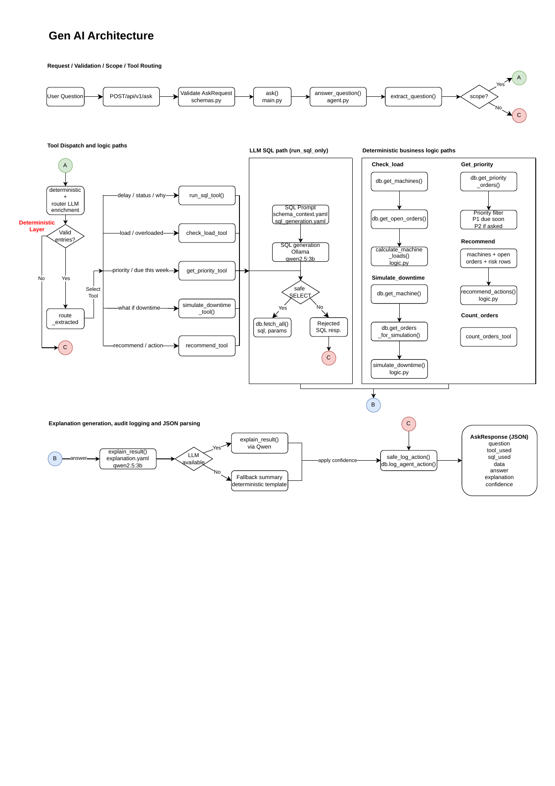
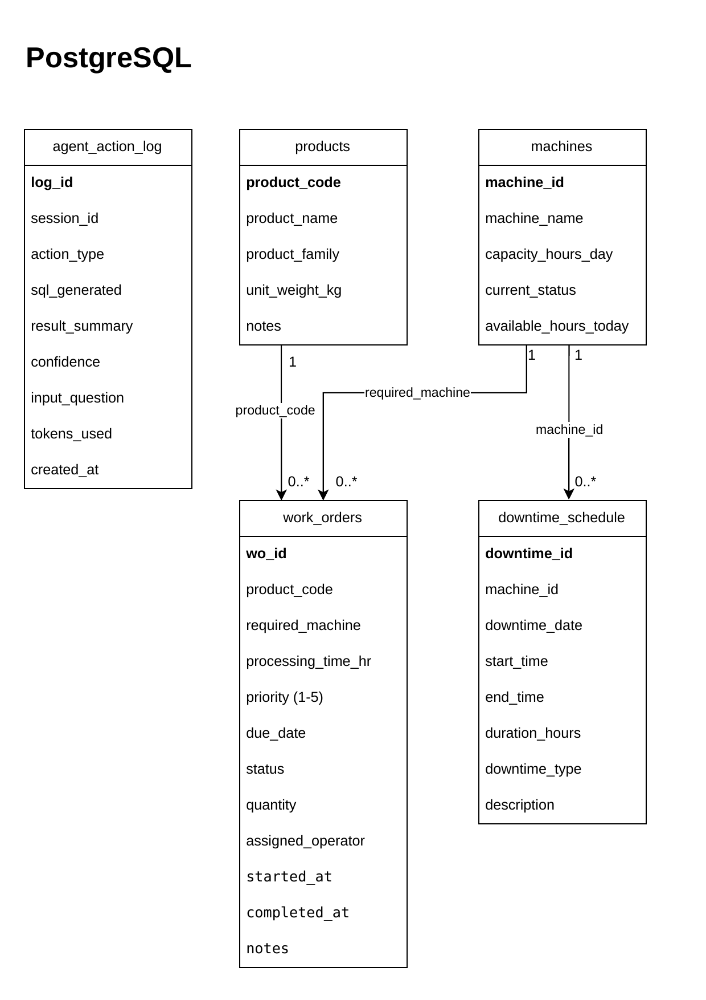

# AI Planning Copilot for Shop Floor Scheduling

[](https://fastapi.tiangolo.com/)
[](https://www.docker.com/)
[](https://www.postgresql.org/)
[](https://ollama.com/)

A FastAPI-based planning copilot for shop-floor scheduling. It answers natural
language questions by combining deterministic scheduling logic, PostgreSQL
queries, prompt-guided SQL generation, and local Qwen explanations through
Ollama.

The main interface is `POST /api/v1/ask`. The project also exposes deterministic
endpoints for machine load, at-risk orders, downtime simulation, and health
checks.

## Quick Start

> [!IMPORTANT]
> First startup can take several minutes because Docker pulls the Ollama image
> and the `qwen2.5:3b` model.

From the project root:

```powershell
docker compose up --build
```

If your Docker version uses the older command style:

```powershell
docker-compose up --build
```

If the model pull is interrupted, rerun:

```powershell
docker exec -it scheduling_ollama ollama pull qwen2.5:3b
```

## Access Points

| Use | URL |
| --- | --- |
| Web UI | `http://localhost:8000/ui/` |
| Swagger docs | `http://localhost:8000/docs` |
| Health check | `http://localhost:8000/api/v1/health` |
| API root | `http://localhost:8000` |

On the same Wi-Fi/LAN, another user can open the UI with your machine's IP:

```text
http://<your-lan-ip>:8000/ui/
```

## Design Diagrams

### Architecture



[Open Architecture PDF](Documents/Architecture.pdf)

### Database



[Open Database PDF](Documents/DB.drawio.pdf)

## API Reference

| Method | Endpoint | Purpose | Example |
| --- | --- | --- | --- |
| `GET` | `/api/v1/health` | Check API and database status. | `curl http://localhost:8000/api/v1/health` |
| `GET` | `/api/v1/machines/load` | Return computed machine load and overload status. | `curl http://localhost:8000/api/v1/machines/load` |
| `GET` | `/api/v1/orders/at-risk` | Return delayed or at-risk work orders. | `curl http://localhost:8000/api/v1/orders/at-risk` |
| `POST` | `/api/v1/simulate/downtime` | Simulate extra downtime for a machine. | See details below. |
| `POST` | `/api/v1/ask` | Ask a natural language scheduling question. | See details below. |

<details>
<summary>Downtime simulation request</summary>

```powershell
curl -X POST http://localhost:8000/api/v1/simulate/downtime -H "Content-Type: application/json" -d "{\"machine_id\":\"M2\",\"downtime_hours\":4}"
```

PowerShell-safe version:

```powershell
Invoke-RestMethod -Method Post -Uri "http://localhost:8000/api/v1/simulate/downtime" -ContentType "application/json" -Body '{"machine_id":"M2","downtime_hours":4}'
```

</details>

<details>
<summary>Natural language ask request</summary>

```powershell
curl -X POST http://localhost:8000/api/v1/ask -H "Content-Type: application/json" -d "{\"question\":\"Which work orders are delayed?\"}"
```

PowerShell-safe version:

```powershell
Invoke-RestMethod -Method Post -Uri "http://localhost:8000/api/v1/ask" -ContentType "application/json" -Body '{"question":"Which machines are overloaded?"}'
```

</details>

## Ask Endpoint Examples

Useful assessment questions:

```text
Which work orders are delayed?
Which machines are overloaded?
Why is WO-1003 at risk?
What happens if M2 is down for 4 extra hours?
Show high-priority orders due this week.
Recommend actions to reduce delays.
```

Example response:

```json
{
  "question": "Which machines are overloaded?",
  "tool_used": "check_load",
  "sql_used": "SELECT machine_id, machine_name, machine_type, capacity_hours_day,\n       available_hours_today, current_status, queued_hours, load_pct\nFROM v_machine_load\nORDER BY load_pct DESC NULLS LAST, machine_id ASC",
  "data": [
    {
      "machine_id": "M3",
      "machine_name": "Hydraulic Press Line 1",
      "machine_type": "Press",
      "capacity_hours_day": 10.0,
      "available_hours_today": 10.0,
      "current_status": "available",
      "queued_hours": 19.0,
      "load_pct": 190.0,
      "load_status": "overloaded"
    }
  ],
  "answer": "Machines returned: M3, M6, M5.",
  "explanation": "Machines returned: M3, M6, M5.",
  "confidence": 0.75,
  "follow_ups": [
    "Which machines are causing the most delays?",
    "Show high-priority orders due this week."
  ]
}
```

## Project Structure

```text
Take-home-assignment/
  docker-compose.yml        # API, PostgreSQL, Ollama, model pull service
  requirements.txt          # Python dependencies
  Data/seed.sql             # Seed schema, views, and scheduling data
  Documents/                # Architecture and database diagrams
  frontend/index.html       # Plain HTML test UI
  Backend/app/              # FastAPI app, agent, DB access, business logic
  Backend/prompts/          # YAML prompt context for Qwen
  Backend/tests/            # Unit and API tests
```

## Testing

Run tests locally after installing dependencies:

```powershell
python3 -m pip install -r requirements.txt
python3 -m pytest Backend/tests -q
```

Run tests inside the API container:

```powershell
docker exec -it scheduling_api pytest tests -q
```

Check seed data after containers are running:

```powershell
docker exec -it scheduling_db psql -U postgres -d scheduling_db -c "SELECT COUNT(*) FROM work_orders;"
```

Inspect recent agent audit logs:

```powershell
docker exec -it scheduling_db psql -U postgres -d scheduling_db -c "SELECT action_type, input_question, sql_generated, result_summary, confidence, created_at FROM agent_action_log ORDER BY created_at DESC LIMIT 5;"
```

## Architecture Notes

- See [DESIGN.md](DESIGN.md) for concise design rationale and tradeoffs.
- Deterministic routing handles known scheduling questions and business tools.
- Qwen is used for SQL generation in the `run_sql` path and for plain-English explanations.
- Python enforces SQL safety before execution with read-only `SELECT` validation.
- `Backend/prompts/schema_context.yaml` gives Qwen the allowed schema and business context.
- `/api/v1/ask` writes a best-effort audit row to `agent_action_log`.
- If Ollama is unavailable during explanation, the API returns a deterministic fallback summary.

## Known Limitations

- First Docker startup can be slow while Ollama and `qwen2.5:3b` download.
- Qwen 3B may produce imperfect explanations on consumer hardware.
- Tool selection is router/keyword based by design.
- The UI is intentionally minimal.
- There is no multi-turn conversation memory.
